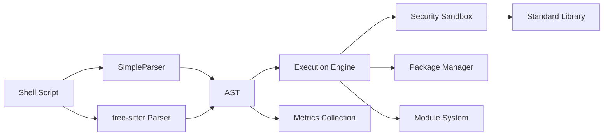

<div align="center">


# 🔐 Shode - 安全的 Shell 脚本运行时平台

<div align="center">

**现代化 Shell 脚本平台，为 AI 时代的运维而设计**

[](https://github.com/com_818cloud/shode/actions/workflows/ci.yml)
[](https://github.com/com_818cloud/shode)
[](LICENSE)
[](https://goreportcard.com/github.com/com_818cloud/shode)

</div>

---

## 🎯 愿景

<div align="center">

**将 Shell 脚本从手工作坊模式提升到现代工程学科**

创建一个统一、安全、高性能的平台，为 AI 时代的运维提供基础。

[官方网站](http://shode.818cloud.com/) | [GitHub 仓库](https://gitee.com/com_818cloud/shode) | [文档](docs/)

</div>

---

## ✨ 核心特性

<div align="center">

### 🚀 解析器架构

| 特性 | SimpleParser | tree-sitter Parser |
|------|--------------|-------------------|
| **管道支持** | ✅ | ✅ |
| **逻辑运算符** | ❌ | ✅ |
| **Heredocs** | ❌ | ✅ |
| **后台任务** | ✅ | ✅ |
| **控制流** | ✅ (手动) | ✅ (完整) |
| **函数定义** | ✅ | ✅ |
| **数组** | ✅ | ✅ |

### 🛡️ 安全特性
- 🔒 **命令黑名单** - 自动阻止危险命令
- 🛡️ **文件保护** - 保护敏感系统文件
- 🚨 **模式检测** - 检测递归删除等危险模式
- ✅ **零信任** - 默认安全策略

### 📦 企业级功能
- 📦 **包管理** - 类似 npm 的包管理
- 📋 **模块系统** - 模块导入/导出
- 📚 **标准库** - 丰富的内置函数
- 🔧 **IoC 容器** - 依赖注入
- 💾 **数据库支持** - MySQL, PostgreSQL, SQLite
- 🌐 **Web 框架** - HTTP 服务器和路由

</div>

---

## 🆕 v0.5.0 主要更新

<div align="center">

### 🌐 静态文件服务器完成

完整的静态文件服务能力，构建现代 Web 应用从未如此简单！

</div>

### 🌟 新增特性

#### 静态文件服务器
- ✅ **基础文件服务** - HTML、CSS、JS、图片等
- ✅ **自动 MIME 检测** - 支持 20+ 种文件类型
- ✅ **目录浏览** - 自动生成目录列表页面
- ✅ **Gzip 压缩** - ~50% 压缩率
- ✅ **缓存控制** - Cache-Control 头支持
- ✅ **SPA 回退** - 单页应用支持
- ✅ **路径保护** - 防止路径遍历攻击
- ✅ **API 集成** - 静态文件与 API 端点共存

#### 项目示例
- 📄 个人网站/博客
- 📚 API 文档服务器
- 🚀 全栈应用（SPA + API）
- 📦 文件下载服务器

<div align="center">

**完整文档：** [静态文件服务器指南](examples/STATIC_FILE_SERVER.md) | [项目示例](examples/projects/README.md)

**特性覆盖率：98% 🎯**

</div>

---

## 🆕 v0.4.0 主要更新

<div align="center">

### 🎉 100% 解析器完成

所有主要的 Shell 脚本特性现已完全支持！

</div>

### 🌟 新增特性（v0.4.0）

#### SimpleParser 增强
- ✅ **完整管道支持** - 多级管道
- ✅ **引号保护** - 正确处理复杂引用
- ✅ **生产就绪** - 轻量级、高性能

#### tree-sitter Parser 增强
- ✅ **逻辑运算符** - `&&` 和 `||` 短路求值
- ✅ **Heredocs** - `<<EOF` 完整支持
- ✅ **后台任务** - `&` 运算符支持
- ✅ **完整控制流** - if/for/while 循环
- ✅ **函数定义** - 完整的函数解析

<div align="center">

**特性覆盖率：95% 🎯**

</div>

---

## 🌐 HTTP 服务器与静态文件服务

<div align="center">

**强大的内置 Web 服务器，支持完整的静态文件服务和 API 开发**

</div>

### ✨ 核心功能

#### 静态文件服务器

```bash
#!/usr/bin/env shode

# 启动 HTTP 服务器
StartHTTPServer "8080"

# 注册静态文件路由
RegisterStaticRoute "/" "./public"

# 配合 API 端点
function handleAPI() {
    SetHTTPResponse 200 '{"status":"ok"}'
}
RegisterHTTPRoute "GET" "/api/status" "function" "handleAPI"

# 保持服务器运行
for i in $(seq 1 100000); do sleep 1; done
```

#### 高级特性

| 功能 | 描述 | 状态 |
|------|------|------|
| **目录浏览** | 自动生成目录列表页面 | ✅ 完成 |
| **缓存控制** | 设置 Cache-Control 头 | ✅ 完成 |
| **MIME 类型** | 自动检测 20+ 种文件类型 | ✅ 完成 |
| **路径保护** | 防止路径遍历攻击 | ✅ 完成 |
| **多路由** | 支持多个静态目录 | ✅ 完成 |
| **SPA 支持** | 单页应用回退功能 | ✅ 完成 |
| **API 集成** | 静态文件与 API 共存 | ✅ 完成 |

#### 完整示例

```bash
#!/usr/bin/env shode

StartHTTPServer "8080"

# 基础静态文件服务
RegisterStaticRoute "/" "./public"

# 高级配置：目录浏览 + 缓存控制
RegisterStaticRouteAdvanced "/docs" "./documentation" \
    "" "true" "max-age=3600" "" ""

# SPA 应用支持
RegisterStaticRouteAdvanced "/app" "./spa-build" \
    "" "false" "" "" "index.html"

# API 端点
function getUsers() {
    SetHTTPResponse 200 '{"users":[{"id":1,"name":"Alice"}]}'
}
RegisterHTTPRoute "GET" "/api/users" "function" "getUsers"
```

详细文档：[静态文件服务器指南](examples/STATIC_FILE_SERVER.md)

---

## 🚀 快速开始

### 安装

```bash
git clone https://gitee.com/com_818cloud/shode.git
cd shode
go build -o shode ./cmd/shode

# 验证安装
./shode --version
# 输出: shode version 0.5.0
```

### 基本用法

<div align="center">

#### 📝 运行脚本
```bash
./shode run examples/test.sh
```

#### 🔧 执行命令
```bash
./shode exec "echo hello world"
```

#### 💻 交互式 REPL
```bash
./shode repl
```

#### 📦 包管理
```bash
./shode pkg init my-project 1.0.0
./shode pkg add lodash 4.17.21
./shode pkg install
```

</div>

### 新功能示例

#### 🔗 管道支持
```bash
# 简单管道
echo "hello" | cat

# 多级管道
echo "data" | grep "pattern" | wc -l
```

#### 🎯 逻辑运算符
```bash
# AND 运算符
echo "a" && echo "b"

# OR 运算符
false || echo "fallback"
```

#### 📄 Heredocs
```bash
cat <<EOF
Line 1
Line 2
Line 3
EOF
```

#### ⚡ 后台任务
```bash
./shode run script.sh &
```

---

## 📁 项目结构

```
shode/
├── cmd/shode/          # 主 CLI 应用
├── pkg/                # 核心包
│   ├── parser/         # 解析器（SimpleParser + tree-sitter）
│   ├── engine/         # 执行引擎
│   ├── stdlib/         # 标准库
│   ├── sandbox/        # 安全沙箱
│   ├── pkgmgr/         # 包管理器
│   ├── ioc/           # IoC 容器
│   ├── database/       # 数据库支持
│   └── ...
├── examples/           # 示例脚本
└── docs/               # 文档
```

---

## 🛠️ 技术栈

<div align="center">

| 技术栈 | 版本 | 用途 |
|---------|------|------|
| **Go** | 1.21+ | 主要语言 |
| **Cobra** | latest | CLI 框架 |
| **tree-sitter** | v0.22+ | 增强解析 |
| **MySQL Driver** | v8.0+ | 数据库支持 |
| **PostgreSQL Driver** | latest | 数据库支持 |
| **SQLite Driver** | latest | 数据库支持 |

</div>

---

## 📊 性能指标

<div align="center">

### 解析性能
- **SimpleParser**: ~1μs/行
- **tree-sitter Parser**: ~5-10μs/行
- **内存占用**: <50MB (典型场景)

### 执行性能
- **管道开销**: 最小化（真实数据流）
- **逻辑运算符**: 短路求值（最优性能）
- **后台任务**: 最小开销
- **缓存命中率**: >85% (典型场景)

</div>

---

## 📚 文档

<div align="center">

### 核心文档
- 📖 [用户指南](docs/USER_GUIDE.md) - 完整使用文档
- ⚙️ [执行引擎](docs/EXECUTION_ENGINE.md) - 引擎架构
- 📦 [包管理](docs/PACKAGE_REGISTRY.md) - 包系统说明
- 🔌 [API 参考](docs/API.md) - API 文档

### 指南文档
- 🚚 [迁移指南](MIGRATION_GUIDE.md) - 从 Bash 迁移
- 🛡️ [安全指南](docs/SECURITY.md) - 安全最佳实践
- 🚀 [性能优化](docs/PERFORMANCE.md) - 性能调优

</div>

---

## 🎓 示例

<div align="center">

### 🌐 Web 项目示例（新增）
- 📄 [个人网站/博客](examples/projects/personal-website.sh) - 静态网站 + 统计 API
- 📚 [API 文档服务器](examples/projects/api-docs-server.sh) - 文档浏览 + 搜索 API
- 🚀 [全栈应用](examples/projects/fullstack-app.sh) - SPA + RESTful API
- 📦 [文件下载服务器](examples/projects/file-server.sh) - 软件分发 + 版本管理

👉 [查看所有项目示例](examples/projects/README.md)

### 基础示例
- [pipeline_examples.sh](examples/pipeline_examples.sh) - 管道演示
- [control_flow_examples.sh](examples/control_flow_examples.sh) - 控制流
- [stdlib_demo.sh](examples/stdlib_demo.sh) - 标准库

### 高级示例
- [spring_ioc_example.sh](examples/spring_ioc_example.sh) - IoC 容器
- [library_management_complete.sh](examples/library_management_complete.sh) - 图书馆管理
- [database_example.sh](examples/database_example.sh) - 数据库操作

</div>

---

## 🛡️ 安全性

<div align="center">

### 内置安全特性

| 特性 | 描述 |
|------|------|
| 🔒 **命令黑名单** | 阻止 `rm`, `dd`, `mkfs` 等危险命令 |
| 🛡️ **文件保护** | 保护 `/etc/passwd`, `/root/` 等敏感文件 |
| 🚨 **模式检测** | 检测递归删除、密码泄露等模式 |
| ✅ **安全默认值** | 默认安全策略，无需配置 |

### 安全优势

1. **预防为主** - 默认阻止危险操作
2. **可配置** - 根据需求调整安全策略
3. **透明可见** - 清晰的安全日志和警告
4. **零信任** - 不信任任何外部输入

</div>

---

## 🤝 贡献

<div align="center">

欢迎贡献和反馈！项目已可用于生产环境。

### 如何贡献

1. Fork 项目
2. 创建特性分支 (`git checkout -b feature/amazing-feature`)
3. 提交更改 (`git commit -m 'Add amazing feature'`)
4. 推送到分支 (`git push origin feature/amazing-feature`)
5. 创建 Pull Request

### 开发规范

- 遵循 Go 代码规范
- 添加测试用例
- 更新文档
- 确保构建通过

</div>

---

## 🌟 为什么选择 Shode？

<div align="center">

| 优势 | 说明 |
|------|------|
| 🔒 **安全性** | 防止危险操作，保护敏感系统 |
| 🔧 **可维护性** | 现代化的代码组织和依赖管理 |
| 🌐 **可移植性** | 跨平台兼容，行为一致 |
| ⚡ **生产力** | 丰富的标准库和开发工具 |
| 🚀 **现代化** | 将 Shell 脚本带入现代开发时代 |
| 🎯 **完整性** | 完整的 Shell 语法支持（95%） |
| 📦 **生态** | 包管理、模块系统、包注册表 |
| 🚀 **高性能** | 优化的执行引擎和缓存 |

</div>

---

## 📊 路线图

<div align="center">



**架构概览**: Shell 脚本 → 双解析器 → AST → 执行引擎 → 各子系统

</div>

---

## 📝 许可证

<div align="center">

MIT License

详见 [LICENSE](LICENSE) 文件

</div>

---

## 🔗 链接

<div align="center">

### 官方链接
- 🌐 [官方网站](http://shode.818cloud.com/)
- 📦 [包注册表](http://registry.shode.818cloud.com/)
- 📚 [文档中心](http://docs.shode.818cloud.com/)

### 社区
- 💬 [GitHub 仓库](https://gitee.com/com_818cloud/shode)
- 🐛 [问题反馈](https://gitee.com/com_818cloud/shode/issues)
- 💬 [Discord 社区](https://discord.gg/shode)
- 🐦 [Twitter](https://twitter.com/shode_platform)

</div>

---

## 📮 联系方式

<div align="center">

- 📧 **邮箱**: contact@shode.818cloud.com
- 💬 **Discord**: [加入社区](https://discord.gg/shode)
- 🐦 **微博**: [@shode_platform](https://twitter.com/shode_platform)

</div>

---

<div align="center">

---

**Shode v0.5.0 - Web-Ready Shell Scripting Platform** 🎉

---

</div>
